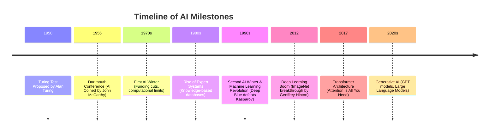

# Introduction to Artificial Intelligence

## 1. What is AI?
At its core, **Artificial Intelligence (AI)** is the simulation of human intelligence processes by machines, especially computer systems. Rather than following fixed instructions, AI systems learn from experience and adjust to new inputs to perform human-like tasks.

### Real-world Examples:
* **Recommendation Engines**: Netflix suggesting movies, YouTube queueing videos, or Spotify generating customized playlists.
* **Smart Assistants**: Siri, Alexa, and Google Assistant understanding voice requests.
* **Autonomous Vehicles**: Tesla Autopilot navigating streets.
* **Smart Keyboards**: Predictive text autocomplete and grammar check engines (like Grammarly).

### Traditional Programming vs. AI:
* **Traditional Programming**: Input Data + Rules $\rightarrow$ Code Executed $\rightarrow$ Output Results.
* **AI/Machine Learning**: Input Data + Output Results $\rightarrow$ Algorithm Trained $\rightarrow$ Rules Discovered (Model).

---

## 2. History of AI

---

## 3. How AI Works

### Core Concepts:
* **Data**: The fuel for AI. Patterns are mined from massive collections of text, images, or sensor feeds.
* **Training**: The process of showing an algorithm examples and correcting its errors (using loss functions and optimization).
* **Neural Networks**: Layered mathematical nodes inspired by biological neurons in the human brain.
* **Models**: The final saved mathematical function representing patterns learned during training.

### Machine Learning vs. Deep Learning:
* **Machine Learning**: Requires manual feature extraction (e.g., humans telling the computer to look for ears, whiskers, and tails to identify a cat).
* **Deep Learning**: A subset of ML utilizing deep neural networks to extract features automatically from raw inputs (e.g., feeding raw pixels directly to the network).

---

## 4. Generative AI vs. Agentic AI

### Generative AI
* **Definition**: AI designed to produce new content (text, images, audio, code) based on prompt patterns it has learned.
* **Capabilities**: Translating, summarizing, programming, and drawing.
* **Example**: ChatGPT generating essays or Midjourney painting graphics.

### Agentic AI
* **Definition**: AI designed to act autonomously, plan multi-step workflows, call external tools, and refine its choices based on environment feedback.
* **Capabilities**: Decision-making, reasoning, task execution, tool use, and self-correction.
* **Example**: An autonomous software developer agent executing commands and fixing its own compilation errors.

---

## 5. Types of AI

* **Artificial Narrow Intelligence (ANI)**: Specialised AI designed to excel at a single task (e.g., chess engines, face recognition). All existing AI is ANI.
* **Artificial General Intelligence (AGI)**: Theoretical AI matching human cognitive capabilities across all domains.
* **Artificial Superintelligence (ASI)**: Hypothetical AI exceeding human capacity in every discipline.
* **Reactive AI**: Systems reacting to inputs without memory (e.g., Deep Blue).
* **Learning AI**: Systems utilizing past feedback loop data to improve performance.

---

## 6. Major AI Fields

* **Computer Vision**: Processing and understanding visual data (images, videos).
* **Natural Language Processing (NLP)**: Understanding, translating, and generating human languages.
* **Robotics**: Actuating mechanical systems to interact physically with environments.
* **Recommendation Systems**: Filtering datasets to suggest relevant items to users.
* **Autonomous Vehicles**: Self-driving cars navigating without human intervention.
* **AI Assistants**: Large Language Models executing tasks based on prompt inputs.
* **Healthcare AI**: Diagnostic imaging, protein folding prediction, and drug discovery.

---

## 7. Pioneers of AI

* **Alan Turing**: Laid the mathematical foundations of computing and proposed the Turing Test.
* **John McCarthy**: Coined the term "Artificial Intelligence" and organized the historic Dartmouth Conference.
* **Geoffrey Hinton**: Popularized backpropagation and neural networks, earning the Turing Award.
* **Yann LeCun**: Pioneered Convolutional Neural Networks (CNNs) for image processing.
* **Yoshua Bengio**: Advanced deep learning architectures and sequence-to-sequence translations.
* **Andrew Ng**: Co-founded Google Brain and Coursera, teaching millions of students AI.
* **Demis Hassabis**: Co-founded DeepMind, developing AlphaGo and AlphaFold.
* **Sam Altman**: CEO of OpenAI, leading the transition of Generative AI into consumer software.
* **Ilya Sutskever**: Chief Scientist of OpenAI, key architect behind GPT architectures and neural scaling laws.

---

## 8. Future of AI

* **Education**: Personalized AI tutors adapting lesson formats to matching student paces.
* **Healthcare**: Real-time diagnostic diagnostics, automated surgery guides, and custom drug formulations.
* **AGI Frontiers**: Development of systems capable of general scientific reasoning.
* **Ethics & Safety**: Addressing bias, deepfakes, privacy concerns, and safety alignment.

---

## 9. AI Myths vs. Reality

* **Myth**: AI has human consciousness and feelings.
  * *Reality*: AI is a highly advanced mathematical pattern matcher; it simulates human responses without internal subjective experience.
* **Myth**: AI can solve any problem instantly.
  * *Reality*: AI requires structured datasets, massive computing power, and fails on novel out-of-distribution reasoning.

---

## 10. Conclusion: From Cosmos to Code
Human intelligence is the product of billions of years of biological evolution. Through silicon and code, humanity has initiated a new spark of digital intelligence. As we transition from biological brains to computing networks, the evolution of code represents our legacy—bridging the gap between cosmic stardust and artificial mind.
